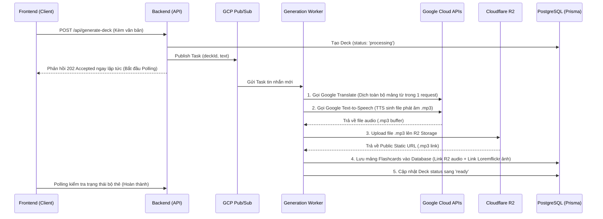

# BÁO CÁO CẤU HÌNH & TÍCH HỢP DỊCH VỤ CLOUD (SMART DECK SYSTEM)

Hệ thống **Tạo bộ thẻ thông minh (Smart Deck)** đã được nâng cấp, tối ưu hóa và tích hợp hoàn chỉnh các dịch vụ Cloud nhằm tối đa hóa hiệu năng và bảo vệ ngân sách Google Cloud (GCP) của bạn.

---

## 1. Tóm tắt các thay đổi đã thực hiện (Changelog)

### Tầng Backend (REST API & Worker)
- **[Tạo mới] [r2Service.js](file:///d:/CKI_CLOUD_g12/Backend/src/services/r2Service.js)**: Khởi tạo S3 Client tích hợp với **Cloudflare R2 Storage** để xử lý upload buffer âm thanh và xuất ra URL tải tĩnh công khai.
- **[Cập nhật] [aiServices.js](file:///d:/CKI_CLOUD_g12/Backend/src/services/aiServices.js)**:
  - Thêm hàm **`translateTextBatch`** để gửi dịch toàn bộ danh sách từ vựng trong **một API request duy nhất** (xóa bỏ hoàn toàn lỗi query N+1 API).
  - Tích hợp hàm `uploadAudio` từ `r2Service.js` vào luồng `generateAudio` để lưu file TTS trực tiếp lên R2.
  - Tối ưu hóa hàm `searchImage` trả về trực tiếp CDN ảnh miễn phí tốc độ cao của **Loremflickr** để bảo toàn 100% quota cho Google Custom Search API.
- **[Cập nhật] [generationWorker.js](file:///d:/CKI_CLOUD_g12/Backend/src/workers/generationWorker.js)**: Tổ chức lại luồng xử lý Pub/Sub, gọi dịch thuật hàng loạt trước tiên, sau đó xử lý song song sinh ảnh & phát âm TTS cho từng từ.
- **[Cập nhật] [authMiddleware.js](file:///d:/CKI_CLOUD_g12/Backend/src/middlewares/authMiddleware.js)**: 
  - Hỗ trợ cơ chế **xác thực kép (Dual Verification)** cho cả JWT Token nội bộ và Firebase ID Token, giải quyết triệt để lỗi chặn kết nối 403 Forbidden.
  - Tích hợp **chuẩn hóa User ID về Database UUID** tự động bằng cách tra cứu Email trong DB, giúp đồng bộ dữ liệu học giữa Firebase UID và Postgres UUID.
- **[Cập nhật] [api.js](file:///d:/CKI_CLOUD_g12/Backend/src/routes/api.js) & [deckController.js](file:///d:/CKI_CLOUD_g12/Backend/src/controllers/deckController.js)**: 
  - Đăng ký thêm API `GET /api/decks/:id` phục vụ cho việc lấy thông tin chi tiết của từng bộ thẻ.
  - Cập nhật API lấy danh sách bộ bài `GET /api/decks` và `GET /api/decks/:id` để **tính toán tự động phần trăm tiến độ học** của user dựa vào số thẻ đã được đánh giá.
- **[Cập nhật] [flashcardController.js](file:///d:/CKI_CLOUD_g12/Backend/src/controllers/flashcardController.js)**: Đăng ký API mới **`POST /api/flashcards/:id/review`** để nhận đánh giá ('hard', 'good', 'easy') và lưu tiến độ học tập theo thuật toán **Spaced Repetition (SM-2)**.

### Tầng Frontend (Giao diện React)
- **[Cập nhật] [Dashboard.tsx](file:///d:/CKI_CLOUD_g12/Frontend/src/pages/Dashboard.tsx)**: 
  - Loại bỏ hoàn toàn Mock Data (dữ liệu giả).
  - Tích hợp các chức năng quản lý bộ thẻ (CRUD): Tìm kiếm, Tạo bộ bài thủ công, Sửa thông tin bộ bài, Xóa bộ bài (tự động cascade xóa flashcards tương ứng).
  - Hiển thị hiệu ứng shimmer động màu vàng khi bộ bài đang được AI sinh thẻ ở background.
- **[Cập nhật] [DeckCard.tsx](file:///d:/CKI_CLOUD_g12/Frontend/src/components/DeckCard.tsx)**: Cấu hình giao diện thẻ tương thích với cấu trúc DB thật, liên kết hiển thị động chỉ số phần trăm tiến độ học và thanh progress, sửa lỗi định dạng prop TypeScript.
- **[Cập nhật] [StudyMode.tsx](file:///d:/CKI_CLOUD_g12/Frontend/src/pages/StudyMode.tsx)**: Định tuyến động qua `/study/:deckId`, fetch flashcard thực tế từ DB và hiển thị nghĩa, ảnh, phát âm thanh thật. Đồng thời gửi yêu cầu API lưu tiến độ học tập (`/api/flashcards/:id/review`) khi người dùng đánh giá thẻ.
- **[Cập nhật] [FlashcardComponent.tsx](file:///d:/CKI_CLOUD_g12/Frontend/src/components/FlashcardComponent.tsx)**: Tích hợp âm thanh phát âm và hiển thị ảnh trực quan ở mặt sau của thẻ học, cập nhật kiểu dữ liệu card ID.

---

## 2. Kiến trúc & Cách thức sử dụng các Dịch vụ Cloud

Sơ đồ quy trình hoạt động của hệ thống khi bạn nhấn nút **Tạo bộ bài**:

### Chi tiết các dịch vụ được sử dụng:
1. **Google Cloud Translation API**: 
   - *Mục đích*: Tự động dịch nghĩa các từ vựng đã bóc tách từ tiếng Anh sang tiếng Việt.
   - *Tối ưu hóa*: Gom tất cả các từ cần dịch vào chung một mảng gửi đi để Google dịch hàng loạt trong **1 request**, loại bỏ hoàn toàn việc gọi vòng lặp gây spam và hao phí tài nguyên GCP.
2. **Google Cloud Text-to-Speech (TTS) API**:
   - *Mục đích*: Chuyển đổi văn bản chữ viết tiếng Anh của các từ vựng thành file âm thanh giọng nói phát âm chuẩn Mỹ (`en-US-Standard-D`).
3. **Cloudflare R2 Object Storage**:
   - *Mục đích*: Lưu trữ các file âm thanh phát âm (.mp3) sinh ra từ Google Cloud TTS.
   - *Cơ chế hoạt động*: Sau khi lấy buffer âm thanh từ Google TTS, Backend sẽ tự động đặt tên file ngẫu nhiên theo mốc thời gian và tải lên R2. Đường dẫn lưu trữ trong Database sẽ là một đường dẫn internet tĩnh tuyệt đối để client có thể phát âm thanh trực tiếp bằng thẻ HTML5 `<audio>` mà không cần load lại từ backend.
4. **Loremflickr (Dịch vụ ảnh công cộng)**:
   - *Mục đích*: Lấy trực tiếp hình ảnh minh họa sống động tương ứng với từ vựng mà không dùng gói Google Custom Search API để đảm bảo **0% chi phí** GCP cho ảnh và không bao giờ bị giới hạn lượt gọi API trong ngày.

---

## 3. Lưu trữ tệp tin & Cấu hình đường dẫn (Media Storage)

### 🔊 Âm thanh phát âm (Audio)
- **Nơi lưu trữ thật**: Lưu trữ tại Bucket **`flashcard-media-assets`** của **Cloudflare R2 Storage** (tương thích chuẩn AWS S3 API).
- **Cấu trúc lưu trên R2**: `audio/{Timestamp}_{Từ_Vựng}.mp3`
- **Đường dẫn lưu trong Database & Gọi ở Frontend**:
  - `https://pub-40c37caa6940412f8e6bf662a11b8c10.r2.dev/audio/{Timestamp}_{Từ_Vựng}.mp3`

### 🖼️ Hình ảnh minh họa (Image)
- **Nơi lấy nguồn**: Sử dụng dịch vụ Dynamic CDN miễn phí của **Loremflickr**.
- **Đường dẫn lưu trong Database & Gọi ở Frontend**:
  - `https://loremflickr.com/320/240/{Từ_Vựng}`
  - CDN của Loremflickr sẽ tự động phân tích từ khóa `{Từ_Vựng}` và chuyển hướng (redirect) trả về ảnh phù hợp nhất với từ khóa đó một cách hoàn toàn tự động.
